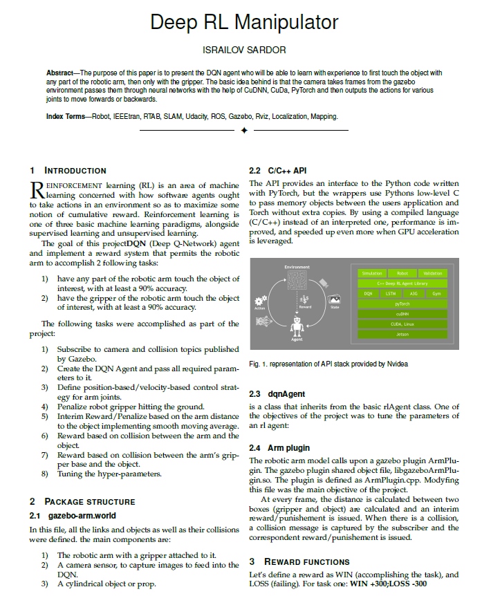
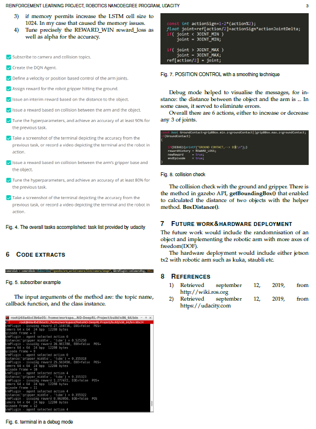

# Deep-RL-Robotic-Arm
Implementation of DQN agent to teach the robotic arm simulated in gazebo to touch the cylinder object with certain parts: gripper, the whole arm.

















































































